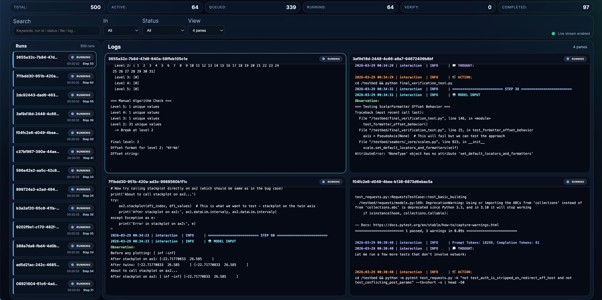

# Uni-Agent: Build, Run, and Train Agents at Scale

[](https://uni-agent.readthedocs.io/en/latest/index.html)
[](./LICENSE)
[](./pyproject.toml)

Uni-Agent is a unified framework for building, running, and training agents at scale. It brings agent interaction, tool use, and RL training into one stack, making it easy to move from lightweight prototyping to large-scale execution and training.

The long-term vision of Uni-Agent is to build the backend infrastructure for next-generation agents that can perceive, act, and explore open-ended tasks.

## Highlights ✨

- **Unified task interface:** Use terminal commands to orchestrate diverse agent tasks such as coding and search, making it easy to customize and run your own agent workflows.
- **Massively parallel interaction:** Support parallel inference and execution for 1k+ concurrent agent tasks with stable, high-throughput runtime performance.
- **Seamless RL training pipeline:** Train predefined agent models without additional adaptation, while leveraging advanced training paradigms such as fully-async and partial rollout.

## Quickstart 🚀

Start with the docs below:

- `Launch`: [Launch an agent environment](https://uni-agent.readthedocs.io/en/latest/start/agent_env.html) to run simple demo scripts.
- `Build`: [Build a simple search agent](https://uni-agent.readthedocs.io/en/latest/start/search_agent.html) with minimal customization for arXiv paper search and recommendation.
- `Scale`: [Run parallel agent interaction](https://uni-agent.readthedocs.io/en/latest/start/agent_interaction.html) for large-scale interaction, inference, and verification workloads.
- `Train`: [Train an agent with reinforcement learning](https://uni-agent.readthedocs.io/en/latest/start/agent_train.html) using state-of-the-art training techniques.

## Live Dashboard 👀

Uni-Agent includes a lightweight dashboard for monitoring large parallel runs in real time. It is designed for workloads such as parallel inference and verification.

Start the dashboard from the repository root:

```bash
python -m dashboard.server --log-dir /tmp/swebench_qwen3_coder --port 8765
```

See [`dashboard/README.md`](./dashboard/README.md) for more details.




## Architecture 🧩


Uni-Agent focuses on agent interaction and builds on top of [verl](https://github.com/verl-project/verl) for scalable training.

- **Interaction-first design:** Uni-Agent isolates the agent interaction stack, so users can focus on agent behavior, tool use, and environment execution without being coupled to training system internals.
- **Modular and loosely coupled components:** The framework is organized around model, tool, and environment modules, making it easy to customize or replace each part independently.
- **From inference to training with one stack:** Uni-Agent provides ready-to-run examples for both large-scale interaction and RL training, making it straightforward to move from prototyping to reproducible experiments.

## Results 📊

### Parallel Inference & Verification

We compare Uni-Agent with existing agent systems on parallel inference and verification workloads.

| Model | Benchmark | OpenHands | Uni-Agent (1-Attempt, Avg@4) |
|-------|:---------:|:---------:|:-----------:|
| Qwen3-Coder-30B  | SWE-Bench_verified |  -   | 48.8 |
| Qwen3-Coder-480B | SWE-Bench-Verified | 62.4 | 62.4 |
| Qwen3-Coder-Next | SWE-Bench-Verified | 66.6 | 67.7 |

### Agent Reinforcement Learning

Uni-Agent supports agent RL training with the same interaction stack used at inference time. A representative recipe is to train [Qwen3-30B-A3B-Instruct](https://huggingface.co/Qwen/Qwen3-30B-A3B-Instruct-2507) on R2E-Gym using **Fully-Asynchronous RL, Partial Rollout, and GSPO**.
Example training scripts are available in [`examples/agent_train`](examples/agent_train).

## Roadmap 🗺️

The roadmap below highlights the next major directions for Uni-Agent.

**Environment Support**

- [ ] Local deployment support.
- [ ] More cloud deployment backends.

**Tool and Task Support**

- [ ] More built-in tools and task patterns.
- [ ] GUI tool support.

**Model Support**

- [ ] DeepSeek model support.
- [ ] Multimodal model support.

## Citation 📚

If you find the project helpful, please cite:

```
@misc{uniagent_github,
  author       = {Yuyang Ding and Guangming Sheng and Xibin Wu and Uni-Agent Contributors},
  title        = {Uni-Agent: Build, Run, and Train Agents at Scale},
  year         = {2026},
  howpublished = {\url{https://github.com/yyDing1/uni-agent}},
  urldate      = {2026-03-27}
}
```

## Contributing 🤝

Community contributions are welcome. See [CONTRIBUTING.md](./CONTRIBUTING.md) for guidelines on how to get started.
