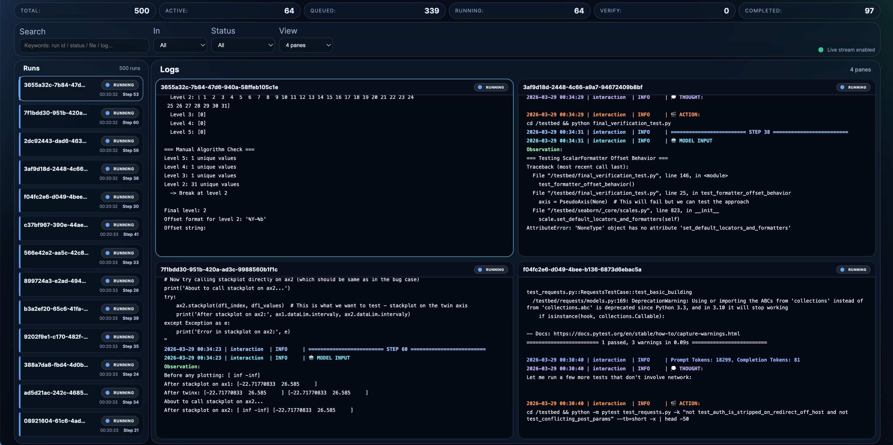

<h1>Uni-Agent: Train Long-horizon Agents at Scale</h1>

<p>
  <a href="https://uni-agent.readthedocs.io/en/latest/index.html"></a>
  <a href="https://github.com/verl-project/uni-agent/stargazers"></a>
  <a href="./LICENSE"></a>
</p>

Uni-Agent is a framework for training long-horizon agents:

- Bring any existing agent harness into reinforcement learning.
- Unify diverse agent tasks through one extensible interface.
- Run agents concurrently at scale and collect traceable trajectories as training-ready data (SFT and RL).

<p>
  
</p>

## Highlights ✨

### Plug in any agent harness

Connect harnesses such as Claude Code and Mini-SWE-Agent, or any harness that can point its OpenAI- or Anthropic-compatible model endpoint at the **Uni-Agent Gateway**: request string in, training tokens out.

### Decouple agents, tasks, and infrastructure

Build white-box agents from reusable `Agent`, `Tool`, `Task`, and `Sandbox` abstractions. Customize agent logic, tools, task environments, sandbox backends, and rewards independently while reusing the same evaluation and training runtime.

### Run thousands of sessions concurrently

Run 1,000+ long-horizon, stateful sessions with distributed workers, pooled Gateway sessions, isolated sandboxes, and asynchronous scheduling. Every trajectory, log, and reward remains associated with the correct session for reliable evaluation, RL training, and data synthesis.

### Reproducible training, verifiable results

We publish runnable [recipes](./examples/) with complete configurations, benchmark settings, result tables, and learning curves. Each recipe provides a tested starting point and makes reported improvements easier to reproduce and verify.

## Quickstart 🚀

Choose the path that matches your goal:

- **Explore the execution stack:** run the [sandbox and tools demo](./examples/agent_env/README.md).
- **Evaluate with an existing model endpoint:** use [`parallel_infer_api.py`](./examples/agent_interaction/parallel_infer_api.py).
- **Evaluate through the training rollout stack:** use [`parallel_infer_verl.py`](./examples/agent_interaction/parallel_infer_verl.py).
- **Train an agent with RL:** start from the recipes in [`examples/agent_train`](./examples/agent_train).

## Architecture 🧩

Uni-Agent separates rollout orchestration from agent and environment execution, with the **Uni-Agent Gateway** acting as the boundary between agent runtimes and the RL system:

1. **Framework Workers** receive prompts and start parallel sessions through the Gateway.
2. A **Task Runner** launches the selected agent—such as Claude Code, Mini-SWE-Agent, or ReAct—against a configurable sandbox backend.
3. The agent sends model requests through its session-scoped Gateway endpoint. The Gateway records the interaction as a token-level trajectory while the task computes its reward.
4. When the session ends, the trajectory and reward are written to the trajectory pool for evaluation or RL training.

For black-box agents, integration can be as small as redirecting the model endpoint to the Gateway. For white-box agents, Uni-Agent provides composable agents, tools, tasks, and sandboxes that can be customized independently.

## Installation 📦

Uni-Agent builds on top of latest `verl` release and can use it as a normal Python package.

```bash
git submodule update --init --recursive
pip install --no-deps -e ./verl

# Other Dependencies
pip install swe-rex loguru pydantic pydantic_settings aiohttp
```

See the full installation guide in the docs: [Installation](https://uni-agent.readthedocs.io/en/latest/start/installation.html).


## Live Dashboard 👀



Uni-Agent includes a lightweight dashboard for monitoring large parallel runs in real time. It is designed for workloads such as parallel inference and reinforcement learning.

Start the dashboard from the repository root:

```bash
python -m dashboard.server --log-dir /tmp/swebench_qwen3_coder --port 8765
```

See [`dashboard/README.md`](./dashboard/README.md) for more details.


## Results 📊

### Parallel Inference & Verification

We compare Uni-Agent with existing agent systems on parallel inference and verification workloads.


| Model            | Benchmark          | OpenHands | Uni-Agent | Setting |
| ---------------- | ------------------ |:---------:|:---------:| ------- |
| Qwen3-Coder-30B  | SWE-Bench Verified | -         | **49.2**  | Avg@4, 100 turns, 128K |
| Qwen3-Coder-480B | SWE-Bench Verified | 62.4      | **64.2**  | Avg@4, 500 turns, 256K |
| Qwen3-Coder-Next | SWE-Bench Verified | 66.6      | **67.6**  | Avg@4, 300 turns, 128K |
| Qwen3.5-35B-A3B  | SWE-Bench Verified | 62.0      | **68.4**  | Avg@1, 200 turns, 128K |
| Qwen3.6-35B-A3B  | Terminal-Bench v2  | -         | **42.5**  | Avg@1, 200K |


### Agent Reinforcement Learning

Uni-Agent supports agent RL training with the same interaction stack used at inference time. We provide fully async training recipes across multiple tasks, models and datasets, with GRPO/GSPO-style objectives and partial rollout support.
Example scripts are available in [examples/agent_train](examples/agent_train).


| Model                        | Dataset      | Method | Setting | Base | RL |
| ---------------------------- | ------------ | ------ | ------- |:----:|:--:|
| Qwen3-30B-A3B-Instruct       | R2E-Gym      | GSPO   | Fully Async, 100 turns, 128K | 22.2 | **36.8** |
| Qwen3-Coder-30B-A3B-Instruct | R2E-Gym      | GSPO   | Fully Async, 100 turns, 128K | 46.2 | **52.0** |
| Qwen3.5-9B                   | SWE-reBench  | GRPO   | Fully Async, 100 turns, 128K | 53.8 | **59.2** |

More training dynamics, including reward, validation score, and average-turn curves, are available in the [agent training guide](https://uni-agent.readthedocs.io/en/latest/start/agent_train.html).


## Roadmap 🗺️

See the [Uni-Agent 26Q3 Roadmap](https://github.com/verl-project/uni-agent/issues/79) for current priorities and planned work.

## Acknowledgement 🙏

Uni-Agent's large-scale parallel interaction and verification rely on remote sandbox backends. We gratefully acknowledge:

- **[veFaaS](https://www.volcengine.com/product/vefaas)**: Volcengine Function-as-a-Service, used as a serverless backend for elastically launching agent sandboxes at scale.
- **[Modal](https://modal.com)**: serverless cloud compute used to spin up isolated, reproducible sandbox environments for agent execution and evaluation.

## Citation 📚

If you find the project helpful, please cite:

```
@misc{uniagent_github,
  author       = {Yuyang Ding and Bo Wen and Xubo Cao and Zhiqiang Zhai and Guangming Sheng and Xibin Wu and Juntao Li and Min Zhang and Uni-Agent Contributors},
  title        = {Uni-Agent: Build, Run, and Train Agents at Scale},
  year         = {2026},
  howpublished = {\url{https://github.com/verl-project/uni-agent}},
  note         = {GitHub repository. Supervisor: Xibin Wu and Juntao Li},
  urldate      = {2026-03-27}
}
```

## Contributing 🤝

Community contributions are welcome. See [CONTRIBUTING.md](./CONTRIBUTING.md) for guidelines on how to get started.
