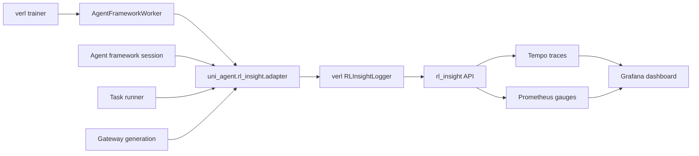
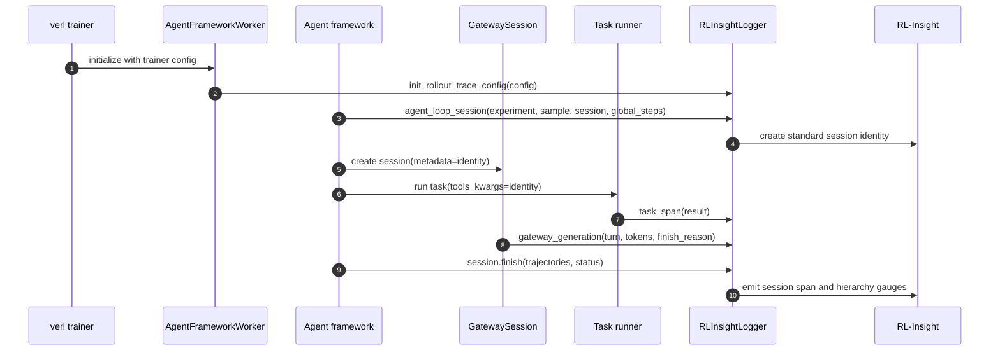

# RL-Insight Instrumentation Guide

Uni-Agent reports business events to RL-Insight through a thin adapter. The
Agent Loop Trajectory dashboard remains framework-independent: Uni-Agent never
defines lane IDs, private dashboard metrics, or the span protocol.

## Instrumented stages

| Stage | Location | Emitted data |
|---|---|---|
| Worker initialization | `uni_agent/framework/entry.py` | Seeds verl's `RolloutTraceConfig` with trainer project/experiment names. |
| Session start | `uni_agent/framework/framework.py` | Creates one agent-loop session and attaches its immutable identity to gateway metadata and task arguments. |
| Task execution | `uni_agent/framework/task_runner.py` | One `agent_task` span with task name, sandbox image, prompt hash, reward, accuracy, completion, and reward-posting state. |
| Model generation | `uni_agent/gateway/session/session.py` | One `gateway_generation` span per gateway call, including chain/trajectory, turn, token counts, finish reason, content, tools, and errors. |
| Session finish | `uni_agent/framework/framework.py` | Publishes trajectory summaries and the `agent_session` span for success, empty, or failure outcomes. |

## Architecture



Uni-Agent calls verl rather than importing trainer configuration directly. This
keeps project/experiment initialization and lazy monitor startup in the trainer
process while leaving business instrumentation in Uni-Agent.

## Training sequence



The exact number and order of task and generation spans follow the
agent's business logic. The only hard requirements are one session object per
agent session, consistent identity fields, and exactly one final `finish` call.

## Adapter API

`uni_agent/rl_insight/adapter.py` is the only Uni-Agent module that knows how to
normalize and forward completed spans.

### `init_rollout_trace_config(config)`

Reads `trainer.project_name` and `trainer.experiment_name` from the worker
configuration and initializes verl's `RolloutTraceConfig`. Call this once before
agent sessions run.

### `TaskSpanState`

Mutable state collected while a task runs. Call `record_result(result,
reward_posted=...)` after the task and reward POST complete. The context manager
reports the final `agent_task` span, including failures that propagate.

### `task_span(tools_kwargs, task_name, prompt)`

Context manager for one task. It reads the trace identity from
`tools_kwargs["_trace_identity"]`, hashes the prompt, tracks task result fields,
and reports the completed span through verl.

### `GenerationSpan`

Mutable state for one gateway generation. `success()` records normal output,
`capacity_exhausted()` records a length-exhausted generation, and `failure()`
records an exception. `report()` derives the zero-based trajectory from the
one-based chain ID and emits `gateway_generation`.

### `start_generation_span(identity)`

Creates a `GenerationSpan` with the session identity and current timestamp.
Gateway code must call `report()` in a `finally` block.

## Verification

The integration was verified with:

- RL-Insight: [#148](https://github.com/verl-project/rl-insight/pull/148)
- Uni-Agent: [#124](https://github.com/verl-project/uni-agent/pull/124)
- verl: [#7448](https://github.com/verl-project/verl/pull/7448)

Apply this NPU-specific diff to `examples/mem_agent/train_mem_agent.sh`:

```diff
diff --git a/examples/mem_agent/train_mem_agent.sh b/examples/mem_agent/train_mem_agent.sh
@@ -5,6 +5,7 @@ SCRIPT_DIR="$(cd "$(dirname "${BASH_SOURCE[0]}")" && pwd)"
 REPO_ROOT="${REPO_ROOT:-$(cd "${SCRIPT_DIR}/../.." && pwd)}"
+VERL_ROOT="${VERL_ROOT:-$(cd "${REPO_ROOT}/.." && pwd)/verl}"
 cd "${REPO_ROOT}"
@@ -74,7 +75,7 @@ NUM_AGENT_WORKERS="${NUM_AGENT_WORKERS:-8}"
 export HYDRA_FULL_ERROR=1
-export PYTHONPATH="${REPO_ROOT}:${REPO_ROOT}/verl:${PYTHONPATH:-}"
+export PYTHONPATH="${REPO_ROOT}:${VERL_ROOT}:${PYTHONPATH:-}"
@@ -78,7 +79,7 @@
 if ! "${RAY_BIN}" status >/dev/null 2>&1; then
-    echo "Starting a local Ray cluster on physical GPUs ${GPU_IDS}..."
-    CUDA_VISIBLE_DEVICES="${GPU_IDS}" "${RAY_BIN}" start --head --num-gpus="${GPU_COUNT}"
+    echo "Starting a local Ray cluster on physical NPUs ${GPU_IDS}..."
+    ASCEND_RT_VISIBLE_DEVICES="${GPU_IDS}" "${RAY_BIN}" start --head --resources="{\"NPU\": ${GPU_COUNT}}"
 fi
@@ -91,7 +92,7 @@
-@ray.remote(num_gpus=int(os.environ["GPU_COUNT"]))
+@ray.remote(resources={"NPU": int(os.environ["GPU_COUNT"])})
 def visible_gpu_ids() -> str:
-    return os.environ.get("CUDA_VISIBLE_DEVICES", "")
+    return os.environ.get("ASCEND_RT_VISIBLE_DEVICES", "")
@@ -114,7 +115,7 @@
 "${RAY_BIN}" job submit --no-wait \
     --working-dir="${REPO_ROOT}" \
-    --runtime-env-json="{\"env_vars\": {\"NCCL_DEBUG\": \"INFO\", \"NCCL_P2P_DISABLE\": \"1\", \"NCCL_IB_DISABLE\": \"1\", \"RAY_DEDUP_LOGS\": \"0\"}}" \
+    --runtime-env-json="{\"env_vars\": {\"PYTHONPATH\": \"${REPO_ROOT}:${VERL_ROOT}\", \"VERL_RL_INSIGHT_ENABLE\": \"1\", \"RL_INSIGHT_SERVER_URL\": \"http://127.0.0.1:18080\", \"NCCL_DEBUG\": \"INFO\", \"NCCL_P2P_DISABLE\": \"1\", \"NCCL_IB_DISABLE\": \"1\", \"RAY_DEDUP_LOGS\": \"0\", \"RAY_OVERRIDE_JOB_RUNTIME_ENV\": \"1\"}}" \
     -- "${PYTHON_BIN}" -m verl.trainer.main_ppo \
@@ -163,6 +164,7 @@
     actor_rollout_ref.rollout.temperature=1.0 \
+    actor_rollout_ref.rollout.disable_log_stats=False \
     actor_rollout_ref.rollout.top_p=0.7 \
```

Run:

```bash
bash examples/mem_agent/train_mem_agent.sh
```

For a short one-step smoke test, append:

```bash
trainer.total_epochs=1 \
trainer.total_training_steps=1 \
data.train_max_samples=4 \
data.val_max_samples=4 \
trainer.test_freq=100 \
trainer.save_freq=100
```

## Related documentation

- [Use RL-Insight to monitor verl training](https://github.com/verl-project/verl/blob/main/docs/advance/rl_insight.md)
- [Agent Loop protocol](https://github.com/verl-project/rl-insight/blob/main/docs/monitor/agent_loop_protocol.md)
